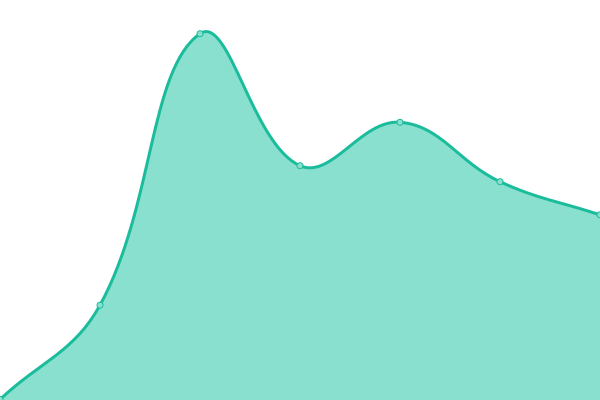
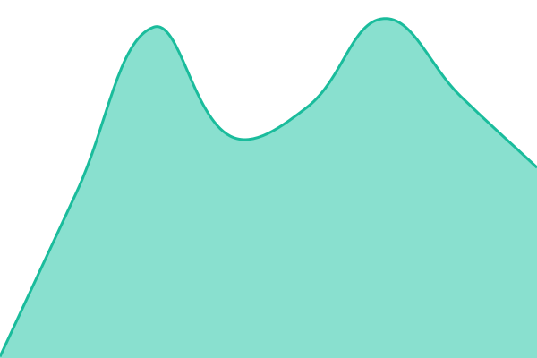
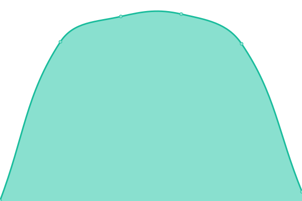
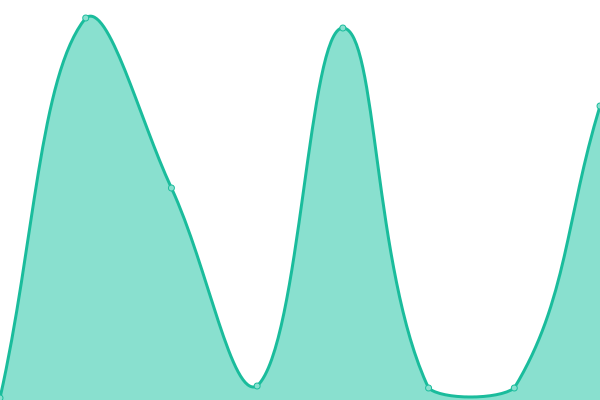
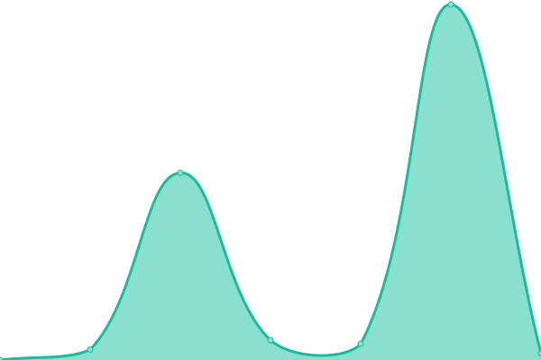
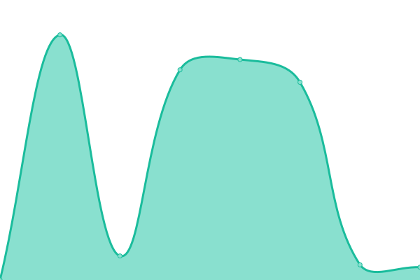
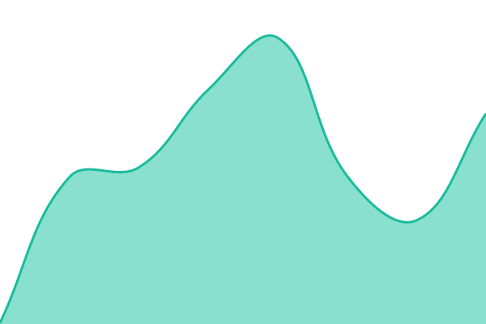
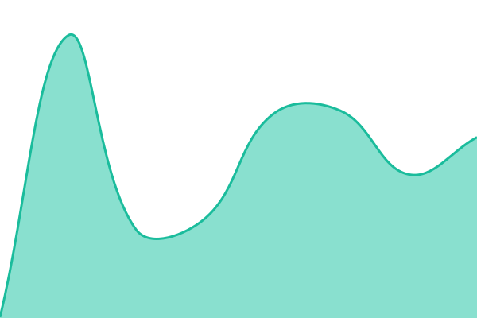

# [📈 Live Status](https://hawkeye.909333.xyz): <!--live status--> **🟧 Partial outage**

This repository contains the open-source uptime monitor and status page for [Upptime](https://upptime.js.org), powered by [Upptime](https://github.com/upptime/upptime).

With [Upptime](https://upptime.js.org), you can get your own unlimited and free uptime monitor and status page, powered entirely by a GitHub repository. We use [Issues](https://github.com/upptime/upptime/issues) as incident reports, [Actions](https://github.com/hamster-yhz/Hawkeye-surveillance/actions) as uptime monitors, and [Pages](https://hawkeye.909333.xyz) for the status page.

<!--start: status pages-->
<!-- This summary is generated by Upptime (https://github.com/upptime/upptime) -->
<!-- Do not edit this manually, your changes will be overwritten -->
<!-- prettier-ignore -->
| URL | Status | History | Response Time | Uptime |
| --- | ------ | ------- | ------------- | ------ |
|  [yuanshen-image](http://yuanshen-image.909333.xyz/) | 🟩 Up | [yuanshen-image.yml](https://github.com/hamster-yhz/Hawkeye-surveillance/commits/HEAD/history/yuanshen-image.yml) | 

 168ms
     
 | 

<a href="https://hawkeye.909333.xyz/history/yuanshen-image">100.00%</a>
    

|  [yuanshen-mail](https://mail.909333.xyz/) | 🟩 Up | [yuanshen-mail.yml](https://github.com/hamster-yhz/Hawkeye-surveillance/commits/HEAD/history/yuanshen-mail.yml) | 

 541ms
     
 | 

<a href="https://hawkeye.909333.xyz/history/yuanshen-mail">100.00%</a>
    

|  [blackbox](http://blackbox.655353.xyz/) | 🟩 Up | [blackbox.yml](https://github.com/hamster-yhz/Hawkeye-surveillance/commits/HEAD/history/blackbox.yml) | 

 141ms
     
 | 

<a href="https://hawkeye.909333.xyz/history/blackbox">100.00%</a>
    

|  [github反代](http://github.909333.xyz/) | 🟥 Down | [github.yml](https://github.com/hamster-yhz/Hawkeye-surveillance/commits/HEAD/history/github.yml) | 

 0ms
     
 | 

<a href="https://hawkeye.909333.xyz/history/github">100.00%</a>
    

|  [aws代理](http://52.53.225.188:8848/panel/) | 🟥 Down | [aws.yml](https://github.com/hamster-yhz/Hawkeye-surveillance/commits/HEAD/history/aws.yml) | 

 0ms
     
 | 

<a href="https://hawkeye.909333.xyz/history/aws">100.00%</a>
    

|  [ulearnling-pro](http://ulearnling-pro.ai4good.dpdns.org/) | 🟩 Up | [ulearnling-pro.yml](https://github.com/hamster-yhz/Hawkeye-surveillance/commits/HEAD/history/ulearnling-pro.yml) | 

 428ms
     
 | 

<a href="https://hawkeye.909333.xyz/history/ulearnling-pro">100.00%</a>
    

|  [New API](http://veloera.ai4good.dpdns.org/) | 🟥 Down | [new-api.yml](https://github.com/hamster-yhz/Hawkeye-surveillance/commits/HEAD/history/new-api.yml) | 

 0ms
     
 | 

<a href="https://hawkeye.909333.xyz/history/new-api">100.00%</a>
    

|  [中国象棋](http://chinese-chess.655353.xyz/) | 🟩 Up | [中国象棋.yml](https://github.com/hamster-yhz/Hawkeye-surveillance/commits/HEAD/history/中国象棋.yml) | 

 154ms
     
 | 

<a href="https://hawkeye.909333.xyz/history/中国象棋">100.00%</a>
    

|  [谜题小游戏](http://qushizitiaozhan.655353.xyz/) | 🟥 Down | [谜题小游戏.yml](https://github.com/hamster-yhz/Hawkeye-surveillance/commits/HEAD/history/谜题小游戏.yml) | 

 91ms
     
 | 

<a href="https://hawkeye.909333.xyz/history/谜题小游戏">0.00%</a>
    

|  [隐私政策](http://blackbox-privacy-policy.655353.xyz/privacy-policy) | 🟩 Up | [隐私政策.yml](https://github.com/hamster-yhz/Hawkeye-surveillance/commits/HEAD/history/隐私政策.yml) | 

 142ms
     
 | 

<a href="https://hawkeye.909333.xyz/history/隐私政策">100.00%</a>
    

<!--end: status pages-->

[**Visit our status website →**](https://hawkeye.909333.xyz)

## 📄 License

- Powered by: [Upptime](https://github.com/upptime/upptime)
- Code: [MIT](./LICENSE) © [Anand Chowdhary](https://anandchowdhary.com), supported by [Pabio](https://pabio.com)
- Data in the `./history` directory: [Open Database License](https://opendatacommons.org/licenses/odbl/1-0/)
